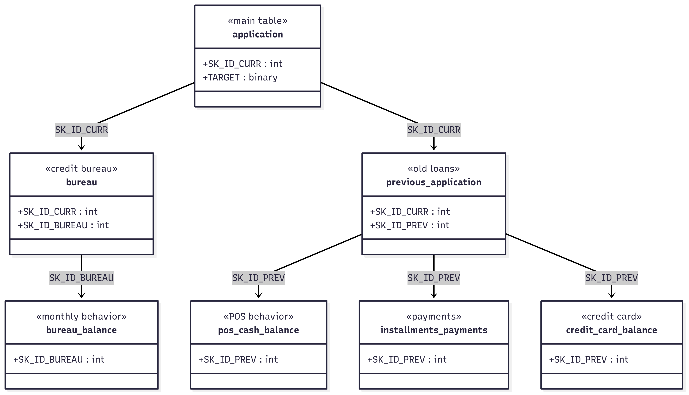

# 📁 Description des fichiers de données – Projet Home Credit

---

## `application_train.csv` et `application_test.csv`
- Fichiers principaux : données d'entraînement (`train`) et de test (`test`)
- `application_train.csv` contient la **variable cible** `TARGET`
- Chaque ligne représente une **demande de crédit**
- Données statiques collectées au moment de la demande (profil client, caractéristiques du prêt)

---

## `bureau.csv`
- Crédits précédents du client **dans d'autres institutions**
- Rapportés par le **Credit Bureau**
- Plusieurs lignes par client : une par ancien crédit

---

## `bureau_balance.csv`
- Historique **mensuel** des anciens crédits présents dans `bureau.csv`
- Comportement de paiement observé par mois
- Granularité très fine : une ligne = un mois d’un crédit

---

## `previous_application.csv`
- Prêts antérieurs du client **chez Home Credit**
- Données relatives à ces anciens prêts (montants, statuts…)
- Plusieurs lignes par client : une ligne par prêt précédent

---

## `POS_CASH_balance.csv`
- Historique **mensuel** des crédits POS (point de vente) et cash **chez Home Credit**
- Relié à `previous_application.csv` via `SK_ID_PREV`
- Une ligne par mois d’un crédit → données comportementales

---

## `installments_payments.csv`
- Historique de **remboursement** des crédits antérieurs
- Une ligne = un paiement (effectué ou manqué)
- Détail de chaque mensualité par crédit → très utile pour analyser les comportements de remboursement

---

## `credit_card_balance.csv`
- Historique **mensuel** des cartes de crédit détenues par le client **chez Home Credit**
- Même logique que `POS_CASH_balance.csv`, mais pour les cartes
- Données comportementales par carte et par mois

---

## `HomeCredit_columns_description.csv`
- Dictionnaire de données
- Donne une description détaillée des colonnes présentes dans tous les fichiers

---

## `sample_submission.csv`
- Format attendu pour la soumission des prédictions dans l’environnement Kaggle

---

## 🔑 Résumé des clés
- `SK_ID_CURR` : identifiant principal du client
- `SK_ID_BUREAU` : identifiant des crédits rapportés par le Credit Bureau
- `SK_ID_PREV` : identifiant des anciens crédits chez Home Credit

---

## Schéma 

